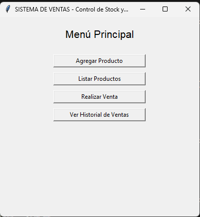
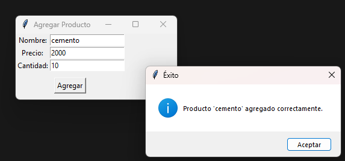
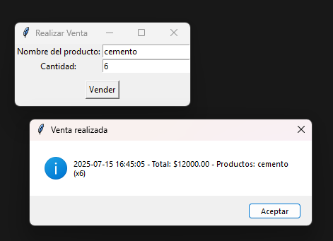

**Documentación Técnica del Sistema de ventas**

---

### ✅ 1. Descripción del problema y motivación

Una pequeña empresa necesita llevar un control organizado de los productos en stock y registrar las ventas realizadas. Actualmente esta tarea se realiza en papel o Excel, lo que genera errores frecuentes, falta de información precisa y demora en la toma de decisiones.

SISTEMA-VENTAS es una aplicación de escritorio con interfaz gráfica que permite:
- Registrar productos con stock y precio
- Realizar ventas de productos
- Consultar el listado de productos disponibles
- Consultar el historial de ventas realizadas

El sistema fue desarrollado en Python, utilizando el paradigma de programación orientada a objetos (POO), patrones de diseño y buenas prácticas de desarrollo.

---

### ✅ 2. Requerimientos funcionales

- ABM de productos (Agregar, Listar, Eliminar)
- Registro de ventas (con actualización automática del stock)
- Consulta de historial de ventas
- Reporte decorado con valor total del inventario

---

### ✅ 3. Casos de uso principales

| Caso de uso          | Actor   | Descripción                                                                 |
|----------------------|---------|------------------------------------------------------------------------------|
| Agregar producto     | Usuario | Carga un nuevo producto con nombre, precio y stock inicial                  |
| Realizar venta       | Usuario | Selecciona productos y cantidades, descuenta del stock y registra la venta  |
| Ver productos        | Usuario | Consulta la lista de productos disponibles con stock actual                  |
| Ver historial ventas | Usuario | Lista las ventas realizadas con fecha, productos y total                    |

---

### ✅ 4. Patrones de diseño utilizados

#### • Factory Method (creacional)
Se utiliza en `ProductoFactory` para instanciar productos sin acoplarse a una clase concreta. Permite extender fácilmente el sistema con otros tipos de productos.

#### • Observer (comportamiento)
El `Inventario` hereda de `Observable` y notifica a sus observadores cuando cambia el stock. Esto permite actualizar vistas u otros componentes sin acoplamiento fuerte.

#### • Decorator (estructural)
Se usa para extender funcionalidad de reportes. `ReporteConTotal` añade al `ReporteProductos` un cálculo del valor total del inventario sin modificar las clases originales.

---

### ✅ 5. Principios SOLID aplicados

- **S**: Cada clase tiene una única responsabilidad clara
- **O**: Las clases están abiertas a extensión (por ejemplo, usando Decorator o Factory)
- **L**: Las subclases podrán sustituir a las superclases sin problemas
- **I**: Interfaces separadas para responsabilidades específicas (p.ej. `Observer`)
- **D**: La GUI depende del controlador, no de clases concretas del modelo

---

### ✅ 6. Instrucciones de ejecución

1. Instalar Python
2. Descomprimir el archivo 
3. Ejecutar el sistema con:
```bash
python main.py
```

No requiere librerías externas. Todo el código está contenido localmente.

---

### ✅ 7. Capturas de pantalla

(Inserto capturas de: menú principal, alta de producto, lista de productos, venta realizada, historial de ventas)
#### 🖼️ Menú principal


#### 🖼️ Alta de producto


#### 🖼️ Lista de productos


#### 🖼️ Realizar venta


#### 🖼️ Historial de ventas


---
